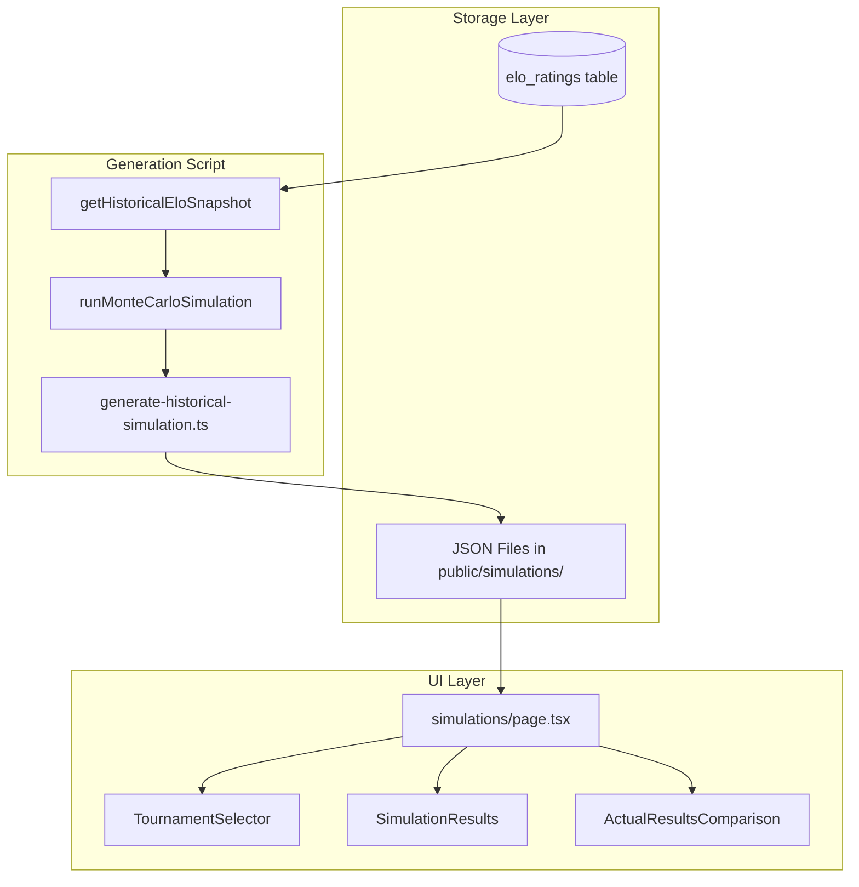

# Historical Tournament Simulations

## Architecture Overview



## Implementation Steps

### 1. Create Tournament Configuration Registry

Create a centralized registry for all tournament formats that can be used by both live and historical simulations.

**File:** `lib/simulation/tournament-formats/index.ts`

This file will:

- Export a `TournamentConfig` type defining format, seeding, teams, and actual results
- Export a registry object mapping tournament IDs to their configs
- Include a helper function `getTournamentConfig(id: string)`

**File:** `lib/simulation/tournament-formats/vct-champions-2025.ts` (update existing)

Refactor to export a full config object including:

- `id`, `name`, `startDate`
- `format` type (e.g., "gsl-groups-double-elim")
- `seeding` (existing)
- `teams` array
- `actualResults` object (winner, runnerUp, top4, etc.)

### 2. Create Historical ELO Snapshot Query

**File:** `lib/simulation/historical/get-elo-snapshot.ts`

Create a function that queries the `elo_ratings` table for the latest rating per team/map before a given date. This mirrors the existing `getCurrentRating` logic in [`db/elo/elo-processor.ts`](db/elo/elo-processor.ts) but returns a full snapshot for all teams.

```typescript
export async function getHistoricalEloSnapshot(
  beforeDate: Date,
  teamSlugs: string[]
): Promise<Record<string, Record<string, number>>>;
```

### 3. Create Pre-computed Results Storage Structure

**Directory:** `public/simulations/`

Each tournament will have a JSON file with this structure:

```json
{
  "tournamentId": "vct-champions-2025",
  "tournamentName": "Valorant Champions 2025",
  "simulatedAt": "2025-09-11T00:00:00Z",
  "eloSnapshotDate": "2025-09-11T00:00:00Z",
  "numSimulations": 10000,
  "results": [
    { "team": "PRX", "teamName": "Paper Rex", "championships": 23.5, ... }
  ],
  "actualResults": {
    "winner": "TL",
    "runnerUp": "PRX",
    "top4": ["TL", "PRX", "SEN", "FNC"]
  }
}
```

### 4. Create Historical Simulation Generation Script

**File:** `scripts/generate-historical-simulation.ts`

This script will:

1. Accept a tournament ID as argument
2. Load the tournament config from the registry
3. Query historical ELO snapshot using the tournament's start date
4. Run Monte Carlo simulation (10,000 iterations)
5. Save results to `public/simulations/{tournament-id}.json`

Add npm script: `"generate:simulation": "tsx scripts/generate-historical-simulation.ts"`

### 5. Refactor Simulation Logic for Reusability

**File:** `lib/simulation/simulation.ts` (modify existing)

Update `runMonteCarloSimulation` to accept:

- Tournament config (instead of hardcoded `VCT_CHAMPIONS_2025_TEAMS`)
- ELO data (instead of calling `getSimulationData` internally)

This allows the same logic to work for both live and historical simulations.

**File:** `lib/simulation/tournament-simulation.ts` (modify existing)

Update `simulateFullTournament` to accept tournament config instead of hardcoded imports.

### 6. Update Simulations Page UI

**File:** `app/simulations/page.tsx`

Replace current placeholder with:

1. Tournament selector dropdown (listing available historical tournaments)
2. Display section showing:

   - Pre-computed simulation results (loaded from JSON)
   - Championship odds chart
   - Round reach heatmap
   - Actual results comparison panel

3. "Upcoming Tournament" section with placeholder message (current behavior)

### 7. Create Historical Results Display Components

**File:** `components/simulations/historical-tournament-view.tsx`

A component that displays:

- Tournament info header (name, date, format)
- Simulation results (reuse existing `TitleOddsChart`, `RoundReachHeatmap`)
- Actual results comparison showing predicted vs actual placements

**File:** `components/simulations/actual-results-comparison.tsx`

A component that shows side-by-side:

- Predicted championship odds vs actual winner
- Predicted top 4/8 vs actual placements
- Highlight accuracy/surprises

## Files to Create/Modify

| File | Action |

| --------------------------------------------------------- | ------------------- |

| `lib/simulation/tournament-formats/index.ts` | Create |

| `lib/simulation/tournament-formats/vct-champions-2025.ts` | Modify |

| `lib/simulation/historical/get-elo-snapshot.ts` | Create |

| `lib/simulation/simulation.ts` | Modify |

| `lib/simulation/tournament-simulation.ts` | Modify |

| `scripts/generate-historical-simulation.ts` | Create |

| `public/simulations/vct-champions-2025.json` | Create (generated) |

| `app/simulations/page.tsx` | Modify |

| `components/simulations/historical-tournament-view.tsx` | Create |

| `components/simulations/actual-results-comparison.tsx` | Create |

| `package.json` | Modify (add script) |

## Future Tournament Additions

Once this infrastructure is in place, adding a new historical tournament requires:

1. Create format file in `lib/simulation/tournament-formats/`
2. Add to registry in `index.ts`
3. Run `npm run generate:simulation -- tournament-id`
