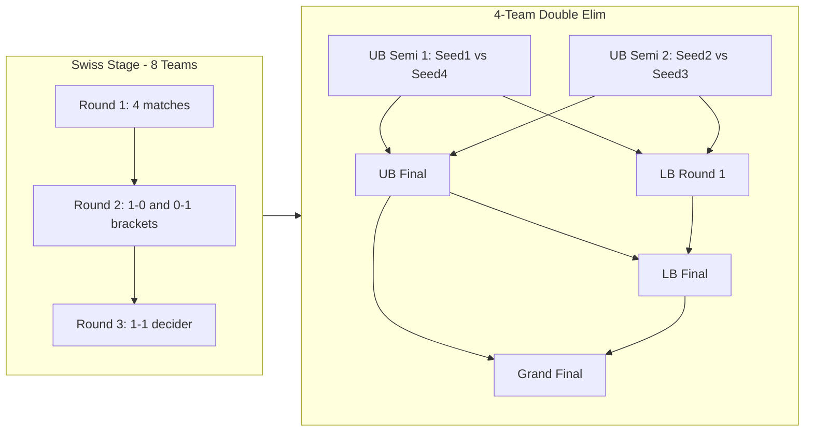

# Masters Bangkok 2025 Tournament Simulation

## Format Overview



**Playoff Seeding:**

- Seed 1 & 2: Teams that went 2-0 in Swiss
- Seed 3 & 4: Teams that went 2-1 in Swiss
- UB Semi 1: Seed 1 vs Seed 4
- UB Semi 2: Seed 2 vs Seed 3

## Implementation Steps

### 1. Add New Tournament Format Type

Update [lib/simulation/tournament-formats/index.ts](lib/simulation/tournament-formats/index.ts):

- Add `"swiss-4team-double-elim"` to `TournamentFormat` type

### 2. Create 4-Team Double Elimination Function

Create new file `lib/simulation/four-team-double-elimination.ts`:

- 6 total matches: 2 UB semis, 1 UB final, 1 LB round 1, 1 LB final, 1 Grand Final
- Accept 4 teams as array (ordered by Swiss seeding)
- Return winner, runnerUp, top3, top4

```typescript
// Bracket structure:
UB-SEMI1: seed1 vs seed4
UB-SEMI2: seed2 vs seed3
UB-FINAL: winner UB-SEMI1 vs winner UB-SEMI2
LB-R1: loser UB-SEMI1 vs loser UB-SEMI2
LB-FINAL: loser UB-FINAL vs winner LB-R1
GRAND-FINAL: winner UB-FINAL vs winner LB-FINAL
```

### 3. Create Bangkok Tournament Simulation

Create new file `lib/simulation/bangkok-tournament-simulation.ts`:

- Import `simulateSwissStage` and new 4-team double elim function
- Run Swiss stage to get 4 qualifiers (already ordered: 2-0 teams first, then 2-1)
- Pass qualified teams to 4-team double elim
- Return combined results

### 4. Create Tournament Config

Create [lib/simulation/tournament-formats/vct-masters-bangkok-2025.ts](lib/simulation/tournament-formats/vct-masters-bangkok-2025.ts):

- Map pool for Feb 2025 (likely: Abyss, Ascent, Bind, Haven, Icebox, Lotus, Split)
- 8 teams with Swiss seeding (you'll provide team slugs)
- Actual results (winner, runner-up, etc.)

### 5. Update Tournament Simulation Dispatcher

Update [lib/simulation/tournament-simulation.ts](lib/simulation/tournament-simulation.ts):

- Import `simulateBangkokTournament`
- Add case for `"swiss-4team-double-elim"` format in `simulateFullTournament`

### 6. Register Tournament

Update [lib/simulation/tournament-formats/index.ts](lib/simulation/tournament-formats/index.ts):

- Import `VCT_MASTERS_BANGKOK_2025_CONFIG`
- Add to `tournamentRegistry`

## Data Needed From You

Before implementing, I need:

1. **8 Swiss stage teams** (seeded 1-8)
2. **Actual results** (winner, runner-up, 3rd place, top4)
3. **Map pool** for Masters Bangkok 2025
